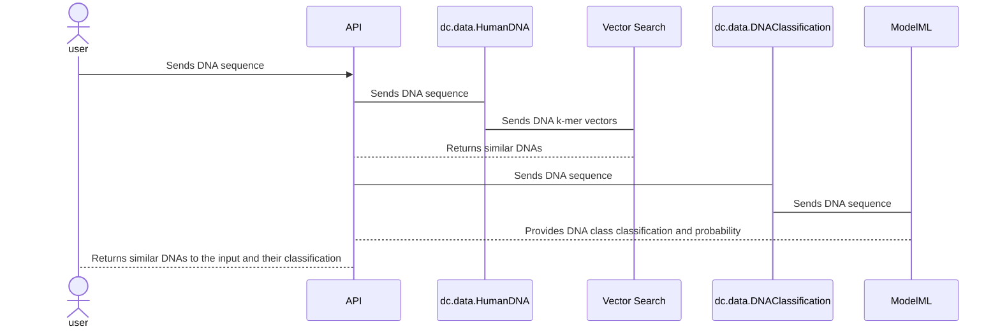

## DNA similarity and classify

The DNA Similarity and Classification is a REST API that utilizes InterSystems Vector Search technology. Its primary aim is to identify genetic similarities by analyzing a vector database derived from interpreting a dataset obtained during the implementation of the project: [Human DNA Sequences Dataset](https://www.kaggle.com/datasets/sooryaprakash12/human-dna-sequences/data?select=human_data.txt).


## Summary
- [Installation](#installation)
- [Video Demo](#video-demo)
- [Solution](#solution)
  - [Vector Search](#vector-search)
  - [Machine Learning](#machine-learning)
  - [Sequence Diagram](#sequence-diagram)
  - [Data Input](#data-input)
  - [Data Output](#data-output)
- [Team Members](#team-members)


## Installation

To download the project, use the following command in the terminal:
```
git clone 
```
To run the project, use the command: 
```
docker-compose up -d --build
```

> ℹ️ **Attention**: The project execution process can take a long time due to the DNA gene vectorization time, between 30 and 40 minutes.


## Video Demo

The explanation of how the project works can be found at this link.

## Solution

## Vector Search

The system is capable of receiving a DNA sequence as input and, through IRIS Vector Search, identifying DNAs with similar genes. This functionality enables rapid identification of patterns and similarities among the provided genetic sequences.

Initially, a long biological sequence is partitioned into "words" of length k with overlap. For instance, when employing "words" of length 6 (referred to as hexamers), the sequence "ATGCATGCA" is segmented into: 'ATGCAT', 'TGCATG', 'GCATGC', 'CATGCA'. Consequently, the example sequence is divided into 4 hexamer words. While hexamers are utilized here, the word length is arbitrary and can be adjusted to accommodate specific requirements. Both the word length and the degree of overlap must be determined empirically for each application. In genomics, these procedures are commonly known as "k-mer counting," where the frequencies of each possible k-mer are tallied.

In this project, k-mer counting serves as a foundational technique for processing genetic sequence data, facilitating the comparative analysis of DNA.


DNA sequences are vectorized based on k-mers, utilizing IRIS vector search for storage and retrieval, enabling the identification of DNAs similar to the received DNA within the database.

## Machine Learning

Furthermore, the system provides a solution for processing and analyzing genetic sequence data using machine learning. Definitions are provided for each of the seven classes, along with their respective quantities in human training data. These classes represent functional groups of genetic sequences.


- <b>G protein coupled receptors</b>: G protein-coupled receptors are a class of cell membrane proteins that detect signaling molecules and activate signal transduction pathways within the cell.

- <b>tyrosine kinase</b>: Tyrosine kinases are enzymes that transfer phosphate groups from ATP to tyrosine residues in target proteins, playing important roles in regulating cellular processes such as growth, differentiation, and cell death.

- <b>tyrosine phosphatase</b>: Tyrosine phosphatases are enzymes that remove phosphate groups from tyrosine residues in proteins, playing a role in regulating cellular processes opposite to tyrosine kinases.

- <b>synthetase</b>: Synthetases are enzymes that catalyze the synthesis of complex molecules from simpler units, typically utilizing ATP energy.

- <b>synthase</b>: Similar to synthetases, synthases also catalyze synthesis reactions but typically do not require ATP energy.

- <b>ion channel</b>: Ion channels are cell membrane proteins that allow selective transport of ions across the membrane, playing a crucial role in regulating membrane potential and transmitting electrical signals in cells.

- <b>transcription factor</b>: Transcription factors are proteins that bind to DNA and control gene transcription, thereby regulating gene expression and influencing various cellular and developmental processes.

### Machine learning model validation

```
  Predicted   0    1   2    3    4   5    6
  Actual                                   
  0          99    0   0    0    1   0    2
  1           0  104   0    0    0   0    2
  2           0    0  78    0    0   0    0
  3           0    0   0  124    0   0    1
  4           1    0   0    0  143   0    5
  5           0    0   0    0    0  51    0
  6           1    0   0    1    0   0  263
  accuracy = 0.984 
  precision = 0.984 
  recall = 0.984 
  f1 = 0.984
```


## Sequence Diagram



## Data Input

The API can be accessed via the following address:

```http://localhost:52773/api/dna/find?&dna=<YOUR_DNA>```

- ```dna```: Enter the DNA sequence you want to search

Example:

    http://localhost:52773/api/dna/find?&dna=ATGAACCGTCCAGCCCCTGTGGAGATCTCCTATGAGAACATGCGTTTTCTGATAACTCACAACCCT


## Data Output

When making the request, consider the following response format in JSON:

``` JSON
{
  "DNA_similarity_list": [
    {
      "sequence": "ATGAACCGTCCAGCCCCTGTGGAGATCTCCTATGAGAACATGCGTTTTCTGATAACTCACAACCCT",
      "dnaClass": "tyrosine phosphatase"
    },
    {
      "sequence": "ATGAACCGTCCAGCCCCTGTGGAGATCTCCTATGAGAACATGCGTTTTCTGATAACTCACAACCCTACCAATGCTACTCTCAACAAGTTCACAGAGGAACTTAAGAAGTATGGAGTGACGACTTTGGTTCGAGTTTGTGATGCTACATATGATAAAGCTCCAGTTGAAAAAGAAGGAATCCACGTTCTAGGCACCTGTGCTGGTTGCACTTGCTTTGATTGA",
      "dnaClass": "tyrosine phosphatase"
    },
    {
      "sequence": "ATGAACCGTCCAGCCCCTGTGGAGATCTCCTATGAGAACATGCGTTTTCTGATAACTCACAACCCTACCAATGCTACTCTCAACAAGTTCACAGAGGAACTTAAGAAGTATGGAGTGACGACTTTGGTTCGAGTTTGTGATGCTACATATGATAAAGCTCCAGTTGAAAAAGAAGGAATCCACGTTCTA",
      "dnaClass": "tyrosine phosphatase"
    },
    {
      "sequence": "ATGAACCGTCCAGCCCCTGTGGAGATCTCCTATGAGAACATGCGTTTTCTGATAACTCACAACCCTACCAATGCTACTCTCAACAAGTTCACAGAGGATTGGCCATTTGATGATGGAGCTCCACCCCCTAATCAGATAGTAGATGATTGGTTAAACCTGTTAAAAACCAAATTTCGTGAAGAGCCAGGTTGCTGTGTTGCAGTGCATTGTGTTGCAGGATTGGGAAGGGCACCTGTGCTGGTTGCACTTGCTTTGATTGAATGTGGAATGAAGTACGAAGATGCAGTTCAGTTTATAAGACAAAAAAGAAGGGGAGCGTTCAATTCCAAACAGCTGCTTTATTTGGAGAAATACCGACCTAAGATGCGATTACGCTTCAGAGATACCAATGGGCATTGCTGTGTTCAGTAG",
      "dnaClass": "tyrosine phosphatase"
    },
    {
      "sequence": "ATGAACCGTCCAGCCCCTGTGGAGATCTCCTATGAGAACATGCGTTTTCTGATAACTCACAACCCTACCAATGCTACTCTCAACAAGTTCACAGAGGAACTTAAGAAGTATGGAGTGACGACTTTGGTTCGAGTTTGTGATGCTACATATGATAAAGCTCCAGTTGAAAAAGAAGGAATCCACGTTCTAATGGCAGAGTGA",
      "dnaClass": "tyrosine phosphatase"
    }
  ],
  "DNA_classification": {
    "Classification": "tyrosine phosphatase",
    "Probabilities": {
      "G protein coupled receptors": 3.61515558600789e-55,
      "tyrosine kinase": 3.02143237266085e-72,
      "tyrosine phosphatase": 1,
      "synthetase": 7.71717577726003e-53,
      "synthase": 1.16208261970004e-65,
      "lon channel": 5.68047237753616e-66,
      "transcription factor": 2.98628330965757e-65
    }
  }
}
```
## Technologies Used

- **InterSystems IRIS**: 
Used for creating the vectorized database and structuring the REST API.
- **Docker Container**: Used to create the environment and IRIS application, so that, through a single command, "docker-compose up," the entire project is ready for use.
- **Embedded Python**: Used to create all application scripts, such as: Assembling the vectorized database by inserting VECTOR type data.
- **Vector search**: Used as a mechanism to search for DNA sequences, comparing similar genetic chromosomes in terms of genetic semantics.

## Team Members
[](https://community.intersystems.com/user/davi-massaru-teixeira-muta) : [Davi Muta](https://community.intersystems.com/user/davi-massaru-teixeira-muta)

[](https://github.com/NisckzAlves) : [Nicole Alves](https://community.intersystems.com/user/nicole-raimundo)
